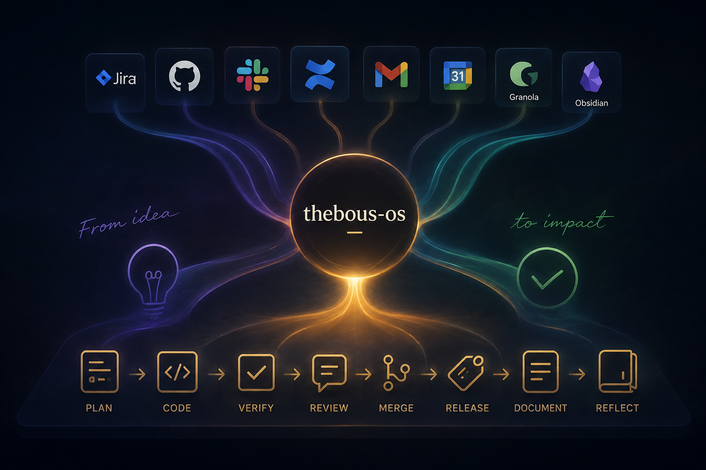

# thebous-os

<p align="center">
  
</p>

Git workflow automation for coding agents, connected to Jira, GitHub, Slack,
Confluence, Gmail, calendar, Granola and Obsidian.

`thebous-os` turns recurring engineering work into reusable skills: start from a
Jira ticket, create a branch, implement and verify a change, open or review a PR,
merge it, update documentation, and keep the activity linked in Obsidian.
It also provides a morning briefing, a live current-status report and an end-of-day
recap.

## What it includes

- Jira task creation with a fixed Italian description and acceptance-criteria template
- Jira → Git branch workflow with status transitions and Slack notifications
- Feature/fix implementation with optional Granola context and Obsidian logging
- PR creation, review, review-feedback resolution and merge workflows
- Release tagging and Jira transitions
- Confluence document creation and update
- Morning briefing, current-day status and end-of-day recap
- Visual explanations of PRs, diffs, code and implementation changes
- Shared provider-neutral credentials and helpers

The workflows are read from the same canonical skills on every provider. External
actions remain explicit: the skills may inspect connected systems, but do not send,
comment, transition, merge or create anything unless the workflow requires it and
the user has reached that step.

## Provider support

| Provider | Integration | Best for |
|---|---|---|
| Claude Code | Native Claude Code plugin marketplace | Slash commands and plugin-scoped skills |
| Codex | Native Codex plugin marketplace | Codex CLI and Codex desktop plugin installation |
| OpenCode | Native local plugin adapter plus canonical skills | Local or project-level OpenCode installations |
| Cursor | Native Cursor plugin plus canonical skills and commands | Cursor Agent and Cursor CLI |

## Installation

### Claude Code

Add the GitHub marketplace from inside Claude Code, then install the plugin:

```text
/plugin marketplace add TheBous/thebous-os
/plugin install thebous-os@thebous-os
```

If Claude Code reports that plugins must be reloaded, run:

```text
/reload-plugins
```

The skills are namespaced with the plugin name, for example:

```text
/thebous-os:setup
/thebous-os:new-branch
/thebous-os:cook
/thebous-os:review-pr
```

To update a previously installed marketplace:

```text
/plugin marketplace update thebous-os
/plugin update thebous-os@thebous-os
```

### Codex

#### Codex CLI

Add the GitHub marketplace and install the plugin:

```bash
codex plugin marketplace add TheBous/thebous-os
codex plugin add thebous-os@thebous-os
```

Alternatively, start `codex` and use `/plugins` to browse configured marketplaces,
inspect the plugin, and enable or disable it.

Start a new Codex session after installation so the bundled skills are discovered.
The skills are available with the `thebous-os:` namespace, for example:

```text
thebous-os:setup
thebous-os:cook
thebous-os:create-pr
thebous-os:current-status
```

Update the marketplace and plugin with:

```bash
codex plugin marketplace upgrade
codex plugin add thebous-os@thebous-os
```

#### Codex desktop

Open the Plugins tab, find `thebous-os` in the configured marketplace, install it,
and start a new chat. Codex desktop and Codex CLI use the same plugin model, but the
IDE extension does not load plugins.

### OpenCode

This repository contains the OpenCode adapter under
`.opencode/plugins/thebous-os.mjs`. The package is currently distributed from GitHub;
the declared npm package is not yet published to the npm registry.

#### Use it in this repository

Clone the repository and start OpenCode from its root:

```bash
git clone https://github.com/TheBous/thebous-os.git
cd thebous-os
opencode
```

OpenCode automatically discovers project plugins in `.opencode/plugins/`.

#### Use it from another project

Clone the repository somewhere stable:

```bash
git clone https://github.com/TheBous/thebous-os.git /absolute/path/to/thebous-os
```

Add the adapter to the other project's `opencode.json`:

```json
{
  "$schema": "https://opencode.ai/config.json",
  "plugin": [
    "/absolute/path/to/thebous-os/.opencode/plugins/thebous-os.mjs"
  ]
}
```

Restart OpenCode. The compatibility commands become available as `/cook`,
`/create-pr`, `/review-pr`, `/current-status`, and so on. The canonical skills are
also registered with OpenCode's native skill discovery.

To update, pull the repository and restart OpenCode:

```bash
cd /absolute/path/to/thebous-os
git pull
```

### Cursor

Import the GitHub repository from Cursor Agent:

```text
/add-plugin
```

Select the `Add Plugin` slash command first. Cursor opens the Plugins view;
paste `https://github.com/TheBous/thebous-os` into `Paste Link` (or the plugin
search field), then choose `thebous-os` and click `Add to Cursor`. Do not paste
the URL in the chat composer while the slash-command suggestions are open.

Cursor loads the canonical skills from `skills/` and workflow commands from
`commands/`. The repository also includes `.cursor-plugin/marketplace.json` for
team marketplace imports.

For local development or when GitHub import is unavailable:

```bash
mkdir -p ~/.cursor/plugins/local
ln -sfn "$PWD" ~/.cursor/plugins/local/thebous-os
```

Run that from the cloned repository, then reload the Cursor window. The plugin
manifest is `.cursor-plugin/plugin.json`.

## First-time configuration

All providers share one configuration file. Run the setup skill once from the
installed plugin:

```text
/thebous-os:setup
```

The file is stored at:

```text
${THEBOUS_OS_DATA_DIR:-${XDG_CONFIG_HOME:-$HOME/.config}/thebous-os}/.env
```

At minimum, Jira REST workflows need:

```dotenv
JIRA_BASE_URL=https://your-domain.atlassian.net
JIRA_EMAIL=your-email@example.com
JIRA_API_TOKEN=your-atlassian-api-token
```

The setup can also configure Jira transition IDs, Slack, Confluence, Obsidian,
GitHub repositories and Gmail. Keep this file outside the repository and never
commit API tokens, app passwords or webhooks.

## Common workflows

| Intent | Skill |
|---|---|
| Configure all integrations | `thebous-os:setup` |
| Create a Jira task | `thebous-os:create-jira-task` |
| Create a branch from a ticket | `thebous-os:new-branch` |
| Implement a feature or fix | `thebous-os:cook` |
| Show the current situation | `thebous-os:current-status` |
| Open a pull request | `thebous-os:create-pr` |
| Review a pull request | `thebous-os:review-pr` |
| Review a PR (multiharness + ponytail) | `thebous-os:review-pr-multiharness-ponytail` |
| Merge a pull request | `thebous-os:merge-pr` |
| Explain a change visually | `thebous-os:explain-change` |
| Run the morning briefing | `thebous-os:morning-briefing` |
| Run the end-of-day recap | `thebous-os:end-of-day` |

## Architecture

```text
skills/<name>/SKILL.md       canonical provider-neutral workflow
commands/<name>.md            thin command adapter
.claude-plugin/               Claude Code plugin and marketplace manifests
.codex-plugin/                Codex plugin manifest
.cursor-plugin/               Cursor plugin and marketplace manifests
.opencode/plugins/            OpenCode discovery adapter
scripts/helpers.sh            shared credentials, Jira, Slack and Obsidian helpers
references/                   shared workflow references
```

Workflow logic is written once in `skills/`. Provider adapters only expose that
logic through the host's native discovery mechanism; they do not duplicate it.

## Development

Requirements: Node.js 18+, Git, and an authenticated `gh` CLI for GitHub workflows.

```bash
npm test
```

The test suite validates skill frontmatter, command adapters, provider portability,
manifest version alignment and key workflow requirements.

Version manifests are bumped automatically by
`.github/workflows/bump-version.yml` after pushes to `main`.

## Contributing

See [CONTRIBUTING.md](CONTRIBUTING.md) for GitHub Flow, pull requests, review
and merge. Do not push to `main` directly.

## Security and privacy

The package can read project activity, Jira data, meeting notes and communication
metadata when the relevant integrations are configured. Review permissions before
installing it, keep credentials in the shared `.env` outside Git, and inspect plugin
hooks or external connectors before enabling them.

## Documentation

- [Contributing](CONTRIBUTING.md)
- [Claude Code plugin marketplaces](https://code.claude.com/docs/en/plugin-marketplaces)
- [Codex plugins](https://developers.openai.com/codex/plugins/)
- [OpenCode plugins](https://opencode.ai/docs/plugins/)
- [Repository](https://github.com/TheBous/thebous-os)
